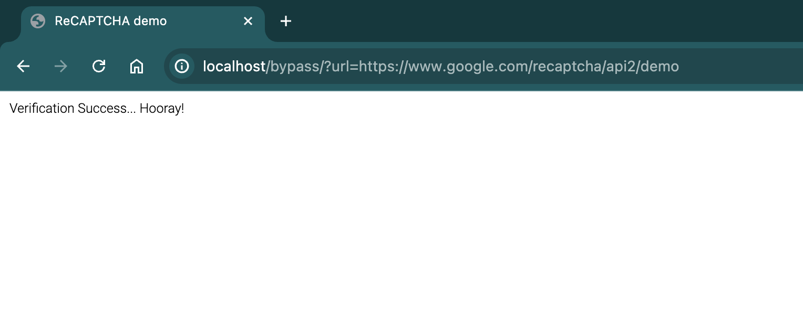

# finerio-asssesment

This file includes a brief explanation and details about the structure of the applications, integrations, technologies used and more, first let's summarize the requirements:

* **Playwright**: Scrapping technology
* **FastAPI**: Web framework for buiding REST API
* **Docker**: Used for building the container
* **Tests**: In this project, for simplicity it was added a unit test of a single file using `Pytest`
* **Lagom**: Dependency injection library used for OpenAI module (used for transcription of audio), Playwright module (used for scrapping) and Utils module (in thiws case used for saving audio file locally)
* **Design Patterns**: It was used strategy pattern to extend and develop different captcha methods, it was implemented with audio strategy, but text of image might be implemented, similar case with pages since the flow may differ with different providers
* **Error handler**: Errors were handled and printed, It would be a great feature to notify on a centralized monitoring or communication platform


## Project Structure:
- `app/`: Main application code resides here.
    - `main.py`: This file should include all different domain routes.
    - `provider/`: Includes top level providers with required dependencies, the container was integrated with `lagom` dependency injection library.
    - `routes/`: Includes all routes required for the API, in this case only `/bypass` was added.
    - `pages/`: Contains strategy implementations for interacting with web pages.
        - `base.py`: Defines the base class for all page strategies, specific pages might be implemented (e.g., login page, search page, etc.).
    - `captcha/`: Contains strategy implementations for handling different captcha types.
        - `base.py`: Defines the base class for all captcha strategies, specific captcha strategies might be implemented (e.g. text, images, etc.).
    - (Other modules): Additional application logic like data access, utility functions, etc.
- `requirements.txt`: Lists all dependencies needed for the project.
- `dev-requirements.txt`: Lists all dev dependencies needed for the project.
- `tests/`: Contains unit tests of the code.

## Getting Started:
1. Install Dependencies:
    ```
    pip install -r requirements.txt
    ```

2. For development install dev devependencies
    ```
    pip install -r dev-requirements.txt
    ```
3. Implement Strategies:
Create concrete subclasses for the expected page and captcha types.
Implement specific logic for interacting with different pages and solving relevant captchas.
Develop Main Application:

3. Integrate the created strategies into your main application.
Choose and use appropriate page and captcha strategies based on the automation flow.

## Running the project
1. Add `.env` file with required variables, in this case an OpenAI api key was used to transcribe the audio content
2. Build the image
    ```
    docker build -t finerio-assessment .
    ```
3. Run the image on port 80
    ```
    docker run -i -d -p 80:80 finerio-assessment
    ```
4. Via postman (method: GET) or browser just get the resource sending url as a query param
    ```
    http://localhost/bypass/?url=https://www.google.com/recaptcha/api2/demo
    ```
5. You will receive the content
    

## Technical documentation

Technical documentation is found in root as `technical_doc.pdf`

## Next steps
There are different improvement points:
* Deploy app, AWS, GCP, DigitalOcean or on premise server
* Include a pipeline to hanlde CI/CD
* Since this is an assessment not all of the modules were tested, then it would be useful to have a 100% of coverage and include it on `.pre-commit-config.yaml` to avoid issues on deployment
* No authentication/authorization was added since it is required on a production environment
